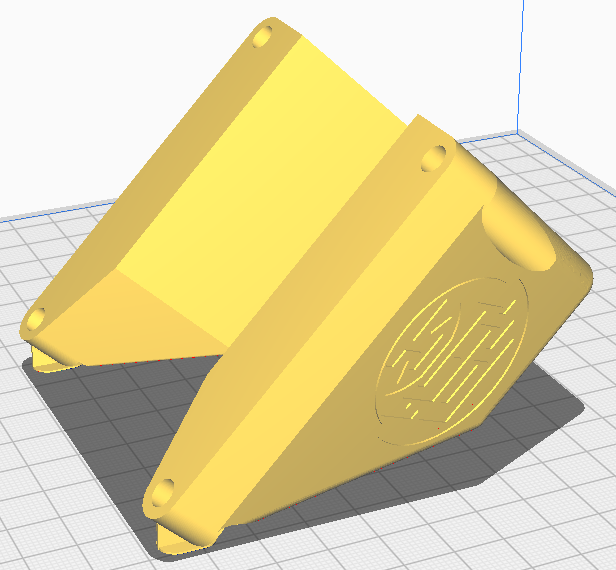
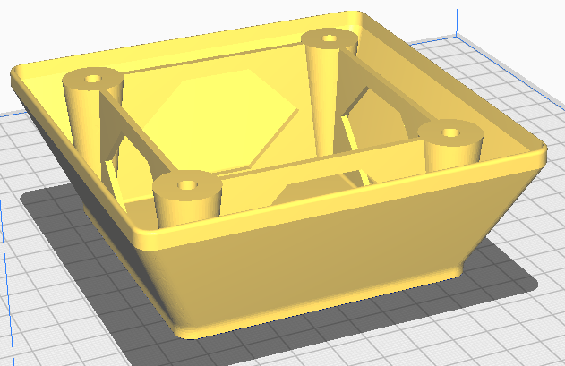
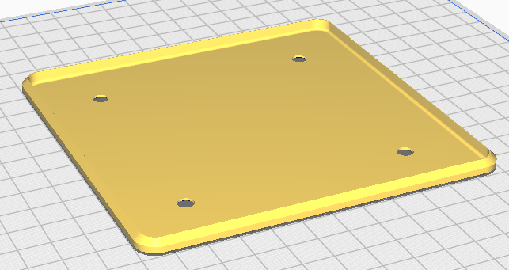
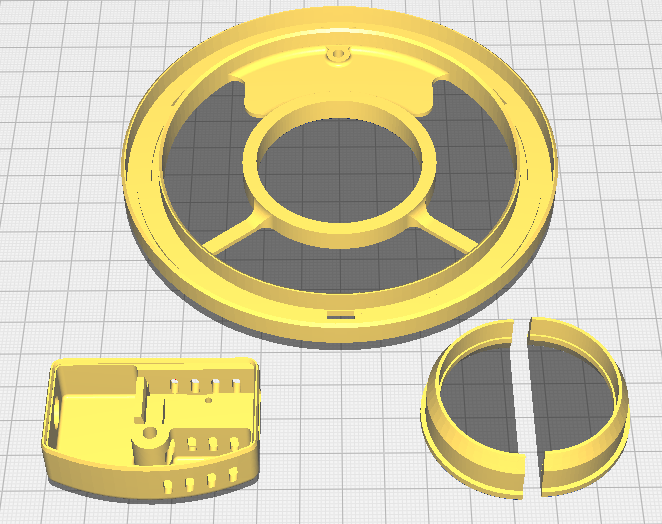
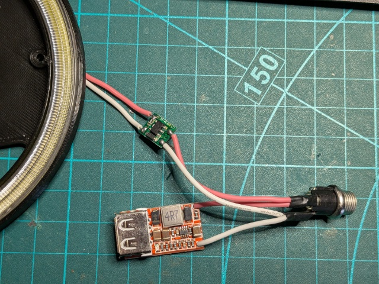
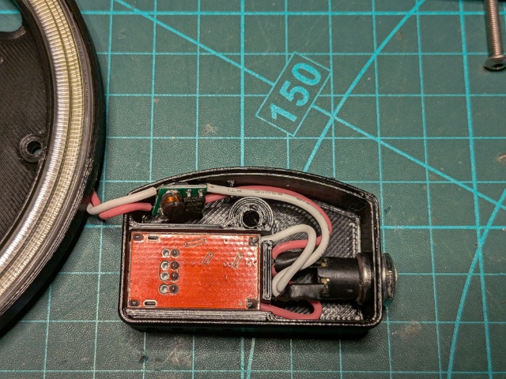

# Printing

## Vesa Mount

Supports (well, more of a brim) are built into the model but if you are printing with fine layer heights, you may need to provide support for the fillet nearest the bed.

## Ballast Box

No support required - the gaps will bridge just fine. And if they don't, they're hidden inside the box!

## Ballast Lid

## Ring Light

Both the ring and lid are printed upside down. No supports required.

# Wiring

The wiring is very simple - 12V from the jack socket to the buck converter and the LED driver (that is comes with the angle eye ring light).

The buck converter is a fairly tight fit - you may need to file the edges of the board before soldering.

Cut the solder/wire ~1mm above the PCB - it should be flush with the inner surface