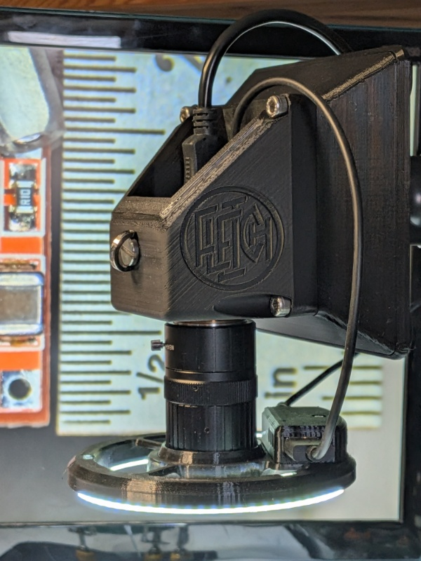
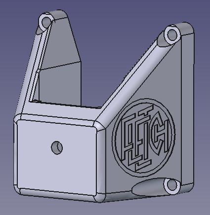
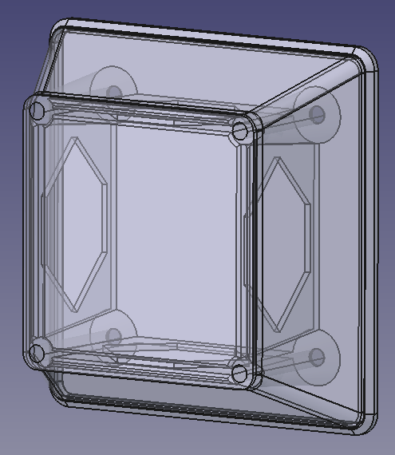
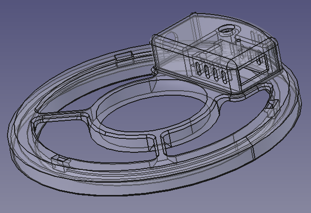
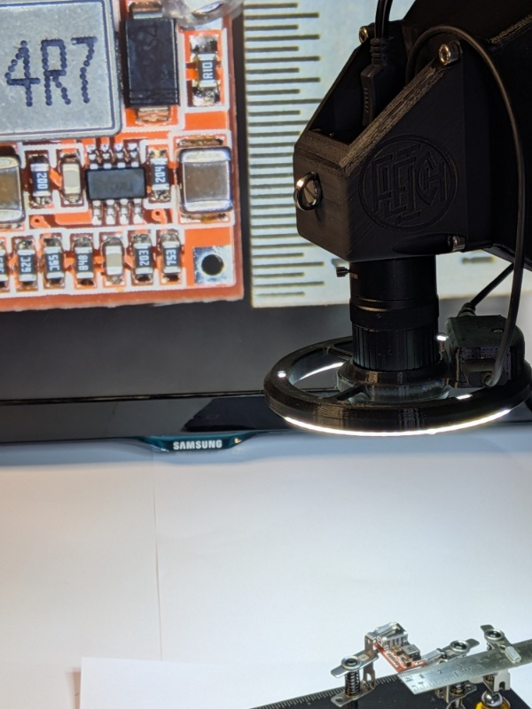

# Digital Soldering Microscope

After much variable and often disappointing research into the available digital microscopes, I decided a side project was required and made my own.

Based on an [ELP HDMI/USB3 UVC camera](https://www.elpcctv.com/4k-usb30-hdmi-camera-with-varifocal-cs-550mm-lens-manual-10x-optical-zoom-p-419.html) with a 5-50mm lens, it is attached to a monitor arm and feeds to a 22" monitor. A spare 110mm 'angel eyes' car light provides excellent illumination.

While this may not provide the optimistic magnification promised by the miriad of manufacturers, at 125mm distance even 0402s are large enough to solder and inspect although I do not plan to solder anything smaller than 0603s...

The lens has a very close minimum focus distance (10mm or less!) so smaller parts can easily be inspected. The aperature adjustment on the lens also enables the depth of field to be increased.

The camera mount consists of three parts:

## Camera Mount

### Main Camera Mount

Designed to hold the ELP camera securely but with plenty of ventilation and fix to a 75mm VESA monitor arm.

### Ballast Box & Lid

Many monitor arms have a minimum weight requirement so this box can be filled with ballast (such as lead shot) and sandwiches between the main camera mout and the VESA bracket while also covering the 100mm mount.

If your monitor arm does not have a minimum weight, you do not have to use this but the ballast should also provide a little mass damping to reduce shake. An active tuned mass damper might make an interesting side project to this side project...

You can adjust the depth oth the ballast box by changing the Z scale in the slicer.

## Ring Light

Using a large (110mm) diameter ring light appear to mitigate the reflection issues that plague the small diameter ones.

The ring light is designed to fit closely over the 5-50mm lens on my camera. It is held in place with either a lens adapter ring (40.5mm thread diameter if anyone wants to know) or a pair of printed collets that will hold it slightly further up the lens.

The box on top takes a 12V supply for the ring light and outputs 5V via USB for the camera.

## In Use

This is a view of the very small buck converter used in the ringlight box. The lens is approximately 125mm from the PCB, so plenty of room for soldering. Each tick on the scale in the image is in half a millimetre.

## Printing and Wiring

More information on printing and wiring [here](PRINTING-WIRING.md).

## License
Creative Commons: [BY-NC-SA 4.0](https://creativecommons.org/licenses/by-nc-sa/4.0/)

